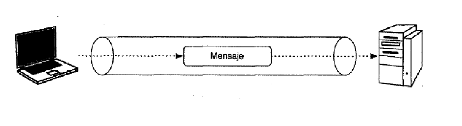

# Sockets UDP

## ¿Qué son los sockets?

Sistema de comunicación entre procesos de diferentes máquinas de una red, por el cual uno o varios procesos pueden emitir o recibir información

Servidor: atiende peticiones (receptor)  
Cliente: solicita conexión (emisor)

## Tipos de sockets

### Sockets TCP

- Orientado a conexión (se requiere inicialmente conexión cliente-servidor) → > tiempo para conexión

### Sockets UDP

- No orientado a conexión (no se requiere conexión)
- El emisor (cliente), en el envío de cada paquete, debe indicar la IP y el puerto de destino. 
- El receptor (servidor) debe extraer la IP y el puerto del emisor.
- No garantiza fiabilidad (los paquetes pueden ser duplicados, perdidos o llegar en un orden diferente)

Ventajas: Más simples y eficientes que los sockets TCP.  
Desventajas: No se garantiza la entrega de paquetes.

### Enlaces de interés

TCP vs UDP: https://www.redeszone.net/tutoriales/internet/tcp-udp-caracteristicas-uso-diferencias/  
TCP and UDP Socket Programming: https://phoenix.goucher.edu/~kelliher/s2011/cs325/feb25.html
