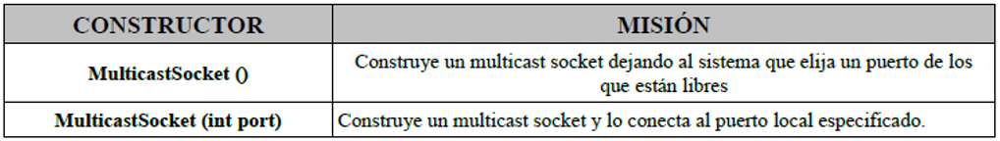
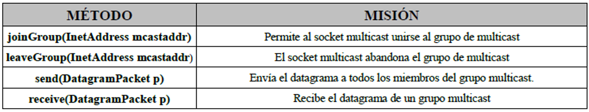

# Sockets multicast 

Son utilizados para enviar paquetes a múltiples destinos simultáneamente.

Es necesario establecer un grupo multicast (grupo de IPs en el mismo puerto)

## MulticastSocket

Para crear un socket multicast que permita establece conexión con un grupo multicast se utiliza MulticastSocket con los siguientes constructores:

Los métodos que proporciona MulticastSocket son:

