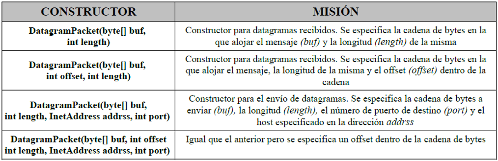
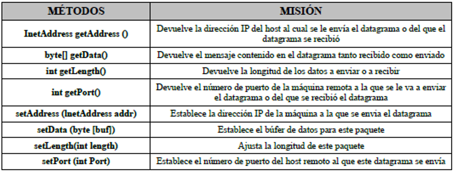
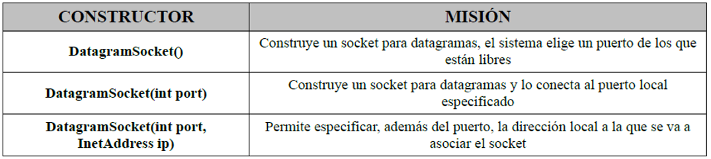
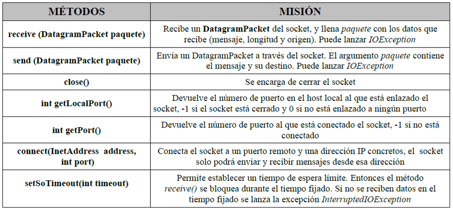

# Sockets UDP en Java

## DatagramPacket

Para crear el datagrama a enviar/recibir se utiliza DatagramPacket con los siguientes constructores:

Los métodos que proporciona DatagramPacket son:

## DatagramSocket

Para crear los sockets que permitan establecer conexión se utiliza DatagramSocket con los siguientes constructores:

Los métodos que proporciona DatagramSocket son:

