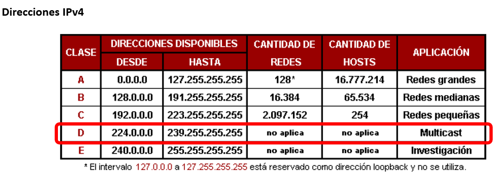
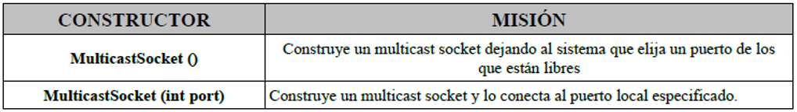
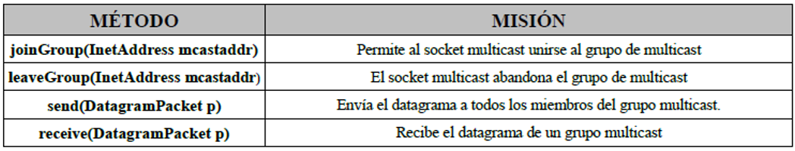

# Sockets multicast 

Son utilizados para enviar paquetes a múltiples destinos simultáneamente.

Es necesario establecer un grupo multicast (grupo de IPs en el mismo puerto)

## Grupo multicast

Grupo al que se unen todos los clientes involucrados. Según el protocolo IPv4 se utilizan las direcciones de Clase D (multicast), de 224.0.0.0 a 239.255.255.255:

## MulticastSocket

Para crear un socket multicast que permita establece conexión con un grupo multicast se utiliza MulticastSocket con los siguientes constructores:

Los métodos que proporciona MulticastSocket son:

