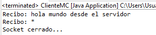

# Multicast1

Al ejecutar el programa se solicita al servidor escribir un mensaje que será enviado a todos los clientes conectados al grupo de difusión.

## Ejecución en Eclipse

En este caso se ejecuta primero el programa ServidorMC.java y posteriormente el programa ClienteMC.java.

De esta forma se puede observar que en el proceso del servidor se puede indicar el mensaje a enviar a todos lo clientes conectados. En este caso se ejecuta el servidor y dos clientes:





## Ejecución en consola

El primer paso es dirigirnos al directorio udp2 y abrir el editor nano para los programas servidor y cliente:


```
nano ServidorMC.java
```

o  

```
nano ClienteMC.java
```

Se debe eliminar la primera línea del programa (package multicast.multicast1;) y guardar los cambios.

Una vez completado este paso se debe compilar cada programa con el siguiente comando:

```
javac ServidorMC.java
```

o 

```
javac ClienteMC.java
```

Tras haber compilado los programas se habrán generado los respectivos archivos .class.

Para ejecutar cada programa se utiliza el comando:

```
java ServidorMC
```

y después en otra(s) terminal(es):  

```
java ClienteMC
```

La ejecución de este programa sería la siguiente:


