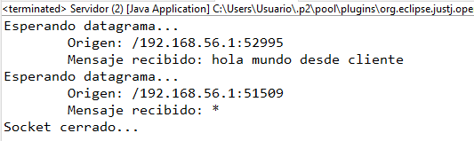
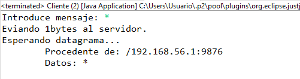
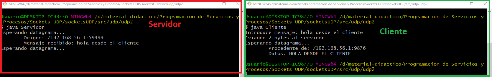

# UDP2

Al ejecutar el programa se solicita al cliente escribir un mensaje que se enviará al servidor y el servidor imprime por pantalla el mensaje recibido, además de enviar al cliente un nuevo mensaje para confirmar la recepción del mismo. 

## Ejecución en Eclipse

En este caso se ejecuta primero el programa Servidor.java y posteriormente el programa Cliente.java.

De esta forma se puede observar en el proceso de la ejecución del servidor que éste recibe el mensaje enviado por el cliente y lo imprime por pantalla:




## Ejecución en consola

El primer paso es dirigirnos al directorio udp2 y abrir el editor nano para los programas servidor y cliente:


```
nano Servidor.java
```

o 

```
nano Cliente.java
```

Se debe eliminar la primera línea del programa (package udp.udp2;) y guardar los cambios.

Una vez completado este paso se debe compilar cada programa con el siguiente comando:

```
javac Servidor.java
```

o 

```
javac Cliente.java
```

Tras haber compilado los programas se habrán generado los respectivos archivos .class.

Para ejecutar cada programa se utiliza el comando:

```
java Servidor
```

y después en otra terminal:  

```
java Cliente
```

La ejecución de este programa sería la siguiente:

